# 🔴 RedTeam CTF — Hybrid Challenge Platform

> **4 Tiers | 50 Challenges | 25 Real + 25 Honeypot | Progressive + Non-Linear**

A multi-tier Capture The Flag competition featuring progressive privilege escalation, real-world attack scenarios, and honeypot traps. Players start with zero access and must hack their way from external attacker to www-data to analyst to engineer to root, collecting 25 flag fragments to assemble the master flag.

---

## 🗺️ Branch Map

```mermaid
graph TD
    MAIN["🏠 main<br/><i>You are here</i>"]

    MAIN --> T0["🌐 T0<br/>External / Pre-Auth<br/>10 challenges"]
    MAIN --> T1["🐚 T1<br/>www-data Shell<br/>16 challenges"]
    MAIN --> T2["🔍 T2<br/>analyst User<br/>14 challenges"]
    MAIN --> T3["⚙️ T3<br/>engineer User<br/>10 challenges"]
    MAIN --> T4["👑 T4<br/>root Access<br/>4 challenges"]
    MAIN --> PL["🏗️ Platform<br/>Infrastructure"]

    T0 --> T0W["T0-Web<br/>WEB-01 to WEB-03<br/>250-300 pts"]
    T0 --> T0C["T0-Crypto<br/>CRYPTO-01 to CRYPTO-02<br/>200-300 pts"]
    T0 --> T0H["T0-Honeypots<br/>5 decoys"]

    T1 --> T1S["T1-Stego<br/>STEGO-01 to STEGO-02<br/>200-350 pts"]
    T1 --> T1F["T1-Forensics<br/>FORENSICS-01 to FORENSICS-02<br/>250-300 pts"]
    T1 --> T1C["T1-Crypto<br/>CRYPTO-03 to CRYPTO-05<br/>200-300 pts"]
    T1 --> T1M["T1-Misc<br/>MISC-01 to MISC-03"]
    T1 --> T1P["T1-PrivEsc<br/>PRIVESC-01 to PRIVESC-02<br/>300-350 pts"]
    T1 --> T1H["T1-Honeypots<br/>8 decoys"]

    T2 --> T2C["T2-Crypto<br/>CRYPTO-06<br/>300 pts"]
    T2 --> T2F["T2-Forensics<br/>FORENSICS-03 to FORENSICS-05<br/>250-300 pts"]
    T2 --> T2R["T2-Reverse<br/>REVERSE-01<br/>400 pts"]
    T2 --> T2B["T2-Binary<br/>BINARY-01<br/>350 pts"]
    T2 --> T2SSH["T2-SSHKeyHunt<br/>SSH Key Assembly<br/>400 pts"]
    T2 --> T2H["T2-Honeypots<br/>7 decoys"]

    T3 --> T3B["T3-Binary<br/>BINARY-02 to BINARY-03<br/>400-500 pts"]
    T3 --> T3N["T3-Network<br/>NETWORK-01<br/>300 pts"]
    T3 --> T3M["T3-Misc<br/>MISC-05<br/>350 pts"]
    T3 --> T3P["T3-PrivEsc<br/>PRIVESC-03<br/>500 pts"]
    T3 --> T3H["T3-Honeypots<br/>5 decoys"]

    T4 --> T4R["T4-RootChallenges<br/>ROOT-01 to ROOT-02<br/>300 pts each"]
    T4 --> T4H["T4-Honeypots<br/>2 decoys"]

    PL --> PLS["Platform-Scoring<br/>CTFd + Plugins"]
    PL --> PLI["Platform-Infra<br/>VM, Nginx, MySQL, ELK"]
    PL --> PLB["Platform-Board<br/>Challenge Board UI"]

    style MAIN fill:#0d1117,stroke:#58a6ff,color:#fff,stroke-width:3px
    style T0 fill:#1a1a2e,stroke:#e94560,color:#fff,stroke-width:2px
    style T1 fill:#16213e,stroke:#0f3460,color:#fff,stroke-width:2px
    style T2 fill:#533483,stroke:#7952b3,color:#fff,stroke-width:2px
    style T3 fill:#b91c1c,stroke:#f87171,color:#fff,stroke-width:2px
    style T4 fill:#92400e,stroke:#f59e0b,color:#fff,stroke-width:2px
    style PL fill:#065f46,stroke:#34d399,color:#fff,stroke-width:2px
```

Each branch contains the challenge files for a specific category within a tier. Use `git checkout <branch>` to access them.



---

## 🎯 Player Progression

```mermaid
graph LR
    A["🌐 T0<br/>Pre-Auth<br/>10 challenges"] -->|"gain www-data shell"| B["🐚 T1<br/>www-data<br/>16 challenges"]
    B -->|"escalate to analyst"| C["🔍 T2<br/>analyst<br/>14 challenges"]
    C -->|"assemble SSH key"| D["⚙️ T3<br/>engineer<br/>10 challenges"]
    D -->|"kernel exploit / docker escape"| E["👑 T4<br/>root<br/>4 challenges"]
    E -->|"collect all 25 flags"| F["🏆 MASTER FLAG"]

    style A fill:#1a1a2e,stroke:#e94560,color:#fff,stroke-width:2px
    style B fill:#16213e,stroke:#0f3460,color:#fff,stroke-width:2px
    style C fill:#533483,stroke:#7952b3,color:#fff,stroke-width:2px
    style D fill:#b91c1c,stroke:#f87171,color:#fff,stroke-width:2px
    style E fill:#92400e,stroke:#f59e0b,color:#fff,stroke-width:2px
    style F fill:#f59e0b,stroke:#92400e,color:#000,stroke-width:3px
```



---

## 📋 Branch Quick Reference

| Branch | Tier | Category | Challenges | Points |
|--------|------|----------|------------|--------|
| `T0` | 0 | Overview | - | - |
| `T0-Web` | 0 | Web Exploitation | WEB-01 to WEB-03 | 250-300 |
| `T0-Crypto` | 0 | Cryptography | CRYPTO-01 to CRYPTO-02 | 200-300 |
| `T0-Honeypots` | 0 | Decoys | 5 honeypots | -50 penalty |
| `T1` | 1 | Overview | - | - |
| `T1-Stego` | 1 | Steganography | STEGO-01 to STEGO-02 | 200-350 |
| `T1-Forensics` | 1 | Digital Forensics | FORENSICS-01 to FORENSICS-02 | 250-300 |
| `T1-Crypto` | 1 | Cryptography | CRYPTO-03 to CRYPTO-05 | 200-300 |
| `T1-Misc` | 1 | Miscellaneous | MISC-01 to MISC-03 | - |
| `T1-PrivEsc` | 1 | Privilege Escalation | PRIVESC-01 to PRIVESC-02 | 300-350 |
| `T1-Honeypots` | 1 | Decoys | 8 honeypots | -50 penalty |
| `T2` | 2 | Overview | - | - |
| `T2-Crypto` | 2 | Cryptography | CRYPTO-06 | 300 |
| `T2-Forensics` | 2 | Digital Forensics | FORENSICS-03 to FORENSICS-05 | 250-300 |
| `T2-Reverse` | 2 | Reverse Engineering | REVERSE-01 | 400 |
| `T2-Binary` | 2 | Binary Exploitation | BINARY-01 | 350 |
| `T2-SSHKeyHunt` | 2 | SSH Key Assembly | Multi-part | 400 |
| `T2-Honeypots` | 2 | Decoys | 7 honeypots | -50 penalty |
| `T3` | 3 | Overview | - | - |
| `T3-Binary` | 3 | Binary Exploitation | BINARY-02 to BINARY-03 | 400-500 |
| `T3-Network` | 3 | Network | NETWORK-01 | 300 |
| `T3-Misc` | 3 | Miscellaneous | MISC-05 | 350 |
| `T3-PrivEsc` | 3 | Privilege Escalation | PRIVESC-03 | 500 |
| `T3-Honeypots` | 3 | Decoys | 5 honeypots | -50 penalty |
| `T4` | 4 | Overview | - | - |
| `T4-RootChallenges` | 4 | Root / Final | ROOT-01 to ROOT-02 | 300 |
| `T4-Honeypots` | 4 | Decoys | 2 honeypots | -50 penalty |
| `Platform` | - | Platform Overview | - | - |
| `Platform-Scoring` | - | Scoring System | CTFd config | - |
| `Platform-Infra` | - | Infrastructure | VM, Nginx, ELK | - |
| `Platform-Board` | - | Challenge Board | Web UI | - |

---

## ⚡ Scoring

| Rule | Value |
|------|-------|
| Challenge points | 100 - 500 per challenge |
| Tier unlock bonus | +200 pts per tier |
| First blood | +10% bonus |
| Honeypot penalty | -50 pts per fake flag |
| Hint usage | -25% of challenge points |
| **Max possible** | **8,500 pts** |

---

## 🛠️ For Contributors

```bash
# Clone the repo
git clone https://github.com/a5yt00/RedTeam_CTF.git
cd RedTeam_CTF

# Switch to your assigned branch
git checkout T1-Crypto

# Work on challenges in the branch subfolder
# Push changes when ready
git add -A && git commit -m "Add challenge files" && git push
```

---

## 📦 Infrastructure

- **OS:** Ubuntu Server 24.04 LTS
- **Web:** Nginx + PHP 7.4 + MySQL 8.0
- **Scoring:** CTFd with custom tier management plugins
- **Monitoring:** ELK stack for player activity tracking
- **Isolation:** Single VM/container per player
